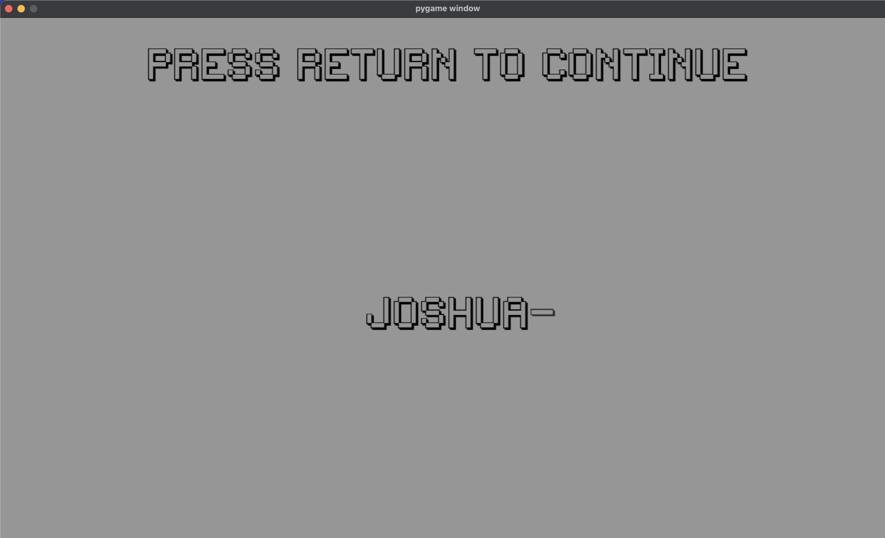
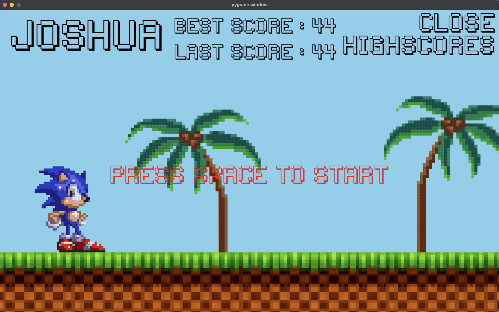

# Sonic Dash: A 2D Platformer Adventure

**Keys:**
- **Jump:** Space bar

**Goal:**
Achieve the highest score by dodging enemies.

**Information:**
- Best scores are saved in `best_score.pickle`.
- Requires the **Pygame** module.

**Running the Game:**
1. Install Pygame: `pip install pygame`
2. Clone/download this repository.
3. Run: `python main.py`

**Screenshots:**

*Login Screen:*

*Start Screen:*

*Gameplay:*

**Features:**
- Smooth animations & character controls
- Randomized enemy spawns
- Interactive background elements
- Visual & audio feedback

**Technologies:**
- Python
- Pygame

**License:**
[MIT License](LICENSE)
